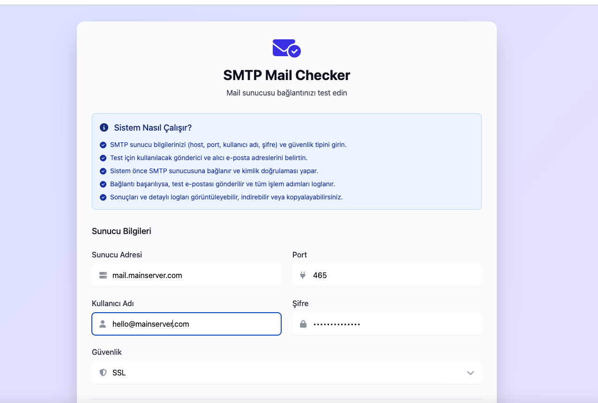
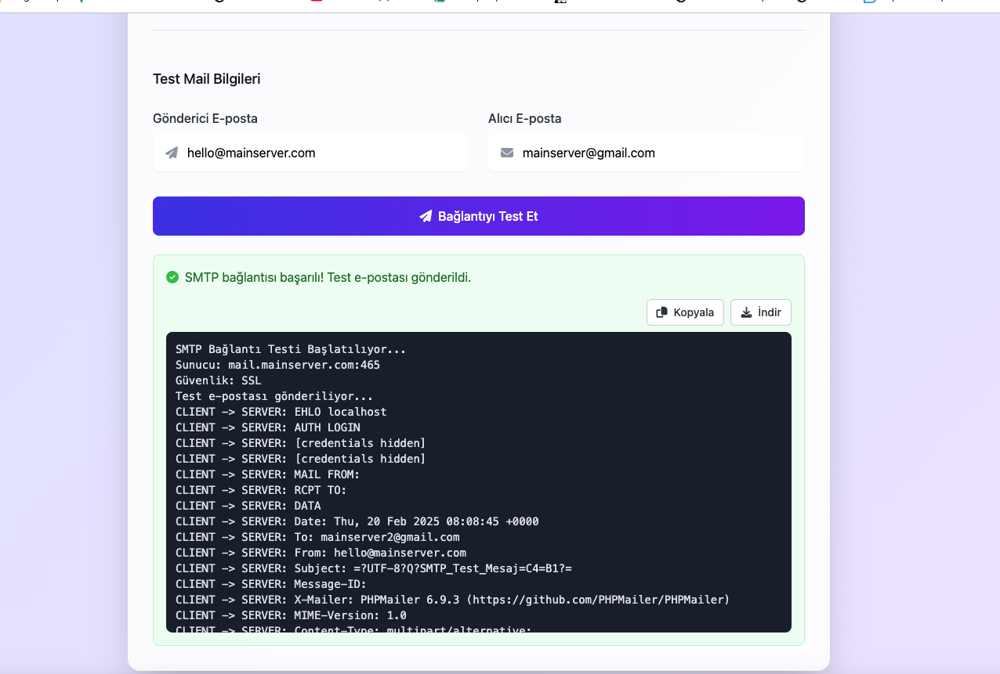
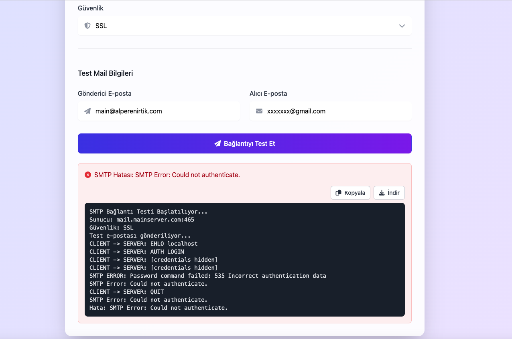

# SMTP Mail Checker

SMTP Mail Checker, e-posta sunucularınızın bağlantı durumunu hızlı ve güvenli bir şekilde test etmenizi sağlayan web tabanlı bir araçtır. Bu uygulama ile SMTP sunucu ayarlarınızı doğrulayabilir, bağlantı sorunlarını tespit edebilir ve test e-postaları göndererek sistemin düzgün çalıştığından emin olabilirsiniz.

🔗 **Demo:** [SMTP Mail Checker](https://proje.alperenirtik.com/proje/smtp-checker/)

## Ekran Görüntüleri

Bu araç özellikle:
- Yeni bir e-posta sunucusu kurulumunda
- Mevcut SMTP ayarlarının kontrolünde
- E-posta gönderim sorunlarının tespitinde
- Sunucu güvenlik ayarlarının doğrulanmasında
kullanışlıdır.

## Özellikler

- **Kolay Kullanım**: Kullanıcı dostu arayüz ile SMTP sunucu testlerini hızlıca gerçekleştirin
- **Detaylı Log Kaydı**: Bağlantı sürecindeki her adımı detaylı olarak görüntüleyin
- **Güvenlik Seçenekleri**: TLS, SSL veya güvenliksiz bağlantı seçenekleri
- **Test E-postası**: Sunucu bağlantısını doğrulamak için test e-postası gönderimi
- **Anlık Sonuçlar**: Bağlantı testinin sonuçlarını anında görüntüleme
- **Log Yönetimi**: Test sonuçlarını indirme ve kopyalama seçenekleri
- **Açık Kaynak**: MIT lisansı ile özgürce kullanılabilir ve geliştirilebilir

## Nasıl Çalışır?

1. **SMTP Sunucu Bilgilerinin Girilmesi**
   - Sunucu adresi (örn: smtp.gmail.com)
   - Port numarası (örn: 587, 465)
   - Kullanıcı adı (e-posta adresi)
   - SMTP şifresi
   - Güvenlik tipi seçimi (TLS/SSL/Güvenliksiz)

2. **Test Mail Bilgilerinin Belirlenmesi**
   - Gönderici e-posta adresi
   - Alıcı e-posta adresi

3. **Bağlantı Testi ve Doğrulama**
   - SMTP sunucusuna bağlantı kurulur
   - Kimlik doğrulaması yapılır
   - Güvenlik ayarları kontrol edilir
   - Test e-postası gönderilir

4. **Sonuçların Görüntülenmesi**
   - Bağlantı durumu (başarılı/başarısız)
   - Detaylı hata mesajları (varsa)
   - İşlem adımlarının logları
   - Test e-postasının durumu

5. **Log Yönetimi**
   - Sonuçları ekranda görüntüleme
   - Log dosyasını indirme
   - Logları panoya kopyalama

## Kullanılan Teknolojiler

- PHP 8.x
- Alpine.js
- Tailwind CSS
- Font Awesome
- PHPMailer

## Lisans

MIT License

## İletişim & Sosyal Medya

- 🌐 Web Site: [alperenirtik.com](https://www.alperenirtik.com)
- 🏢 Kurumsal: [ankasoftyazilim.com](https://www.ankasoftyazilim.com)
- 💼 LinkedIn: [@alperen-irtik](https://www.linkedin.com/in/alperen-irtik-823564233/)
- 👨‍💻 GitHub: [@alperenirtik](https://github.com/alperenirtik) 
